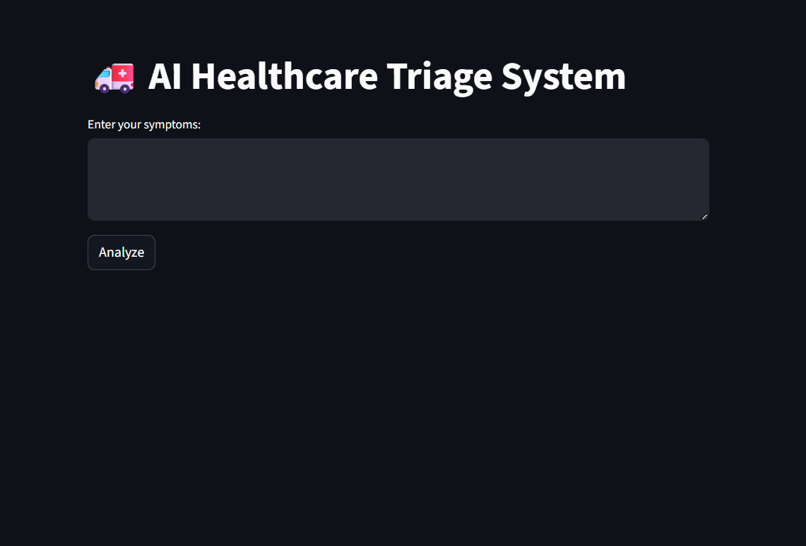
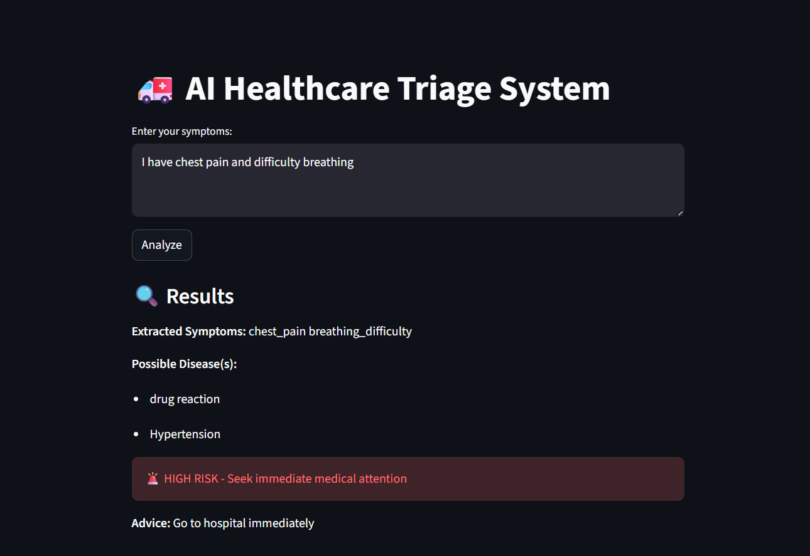

# 🚑 AI Healthcare Triage System

## 🧭 Overview

The **AI Healthcare Triage System** is a decision-support tool designed to help users evaluate the **severity of their symptoms** and determine appropriate next steps.

It combines **machine learning** and **rule-based logic** to:

* 🩺 Predict possible diseases
* 🚦 Classify urgency levels
* 💡 Provide actionable medical guidance

> ⚠️ **Note:** This is *not* a diagnostic system — it assists users but does not replace professional medical advice.

---

## ❗ Problem Statement

Many individuals struggle to assess how serious their symptoms are, leading to:

* 🚨 **Delayed treatment** for critical conditions
* 🏥 **Hospital overcrowding** due to minor cases
* ❓ **Uncertainty** about when to seek medical help

---

## 💡 Proposed Solution

This project introduces an **AI-powered triage assistant** that:

* Accepts symptoms in **natural language**
* Processes and **normalizes user input**
* Predicts diseases using **machine learning models**
* Assigns **urgency levels**
* Provides **clear next-step recommendations**

---

## 🧠 System Workflow

```
User Input (Symptoms)
        ↓
Text Processing
        ↓
TF-IDF Vectorization
        ↓
Logistic Regression Model
        ↓
Disease Prediction
        ↓
Urgency Classification
        ↓
Advice Generation
```

---

## ⚙️ Tech Stack

* 🐍 Python
* 🤖 Scikit-learn
* 📊 Pandas
* 🔢 NumPy
* 🌐 Streamlit

---

## 🚦 Key Features of the project

### 🩺 Disease Prediction

* Predicts **top 1–2 likely diseases**

### 🚨 Urgency Classification

* 🔴 **HIGH** → Immediate medical attention required
* 🟡 **MEDIUM** → Consult a doctor soon
* 🟢 **LOW** → Suitable for home care

### 💡 Smart Guidance

* Provides **clear, actionable advice**

### 🌐 Interactive Interface

* Built using **Streamlit web app**

---

## 📸 Screenshots

### 🏠 Home Interface



### 🔍 Analysis Result



---

## ▶️ Getting Started

### 1️⃣ Clone the Repository

```bash
git clone https://github.com/your-username/healthcare-triage.git
cd healthcare-triage
```

### 2️⃣ Install Dependencies

```bash
pip install -r requirements.txt
```

### 3️⃣ Run the Application

```bash
streamlit run app.py
```

---

## ⚠️ Disclaimer

This project is intended for **educational purposes only**.

* ❌ Not a medical diagnosis tool
* ❌ Not a substitute for professional healthcare advice
* ✔️ Always consult a qualified doctor

---

## 🚀 Future Improvements

* 🤖 Integrate advanced NLP models (BERT, Transformers)
* 🌍 Add multilingual support
* 🎙️ Enable voice input
* 📊 Replace rule-based urgency with ML-based classification
* 📱 Improve mobile UI/UX

---

## 👤 Author

**Rohit Arya**

* 🔗 GitHub: https://github.com/rohitarya25
* 💼 LinkedIn: [www.linkedin.com/in/rohit-arya-2213503a5](http://www.linkedin.com/in/rohit-arya-2213503a5)

---
